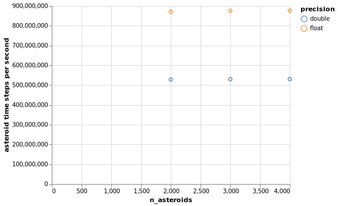
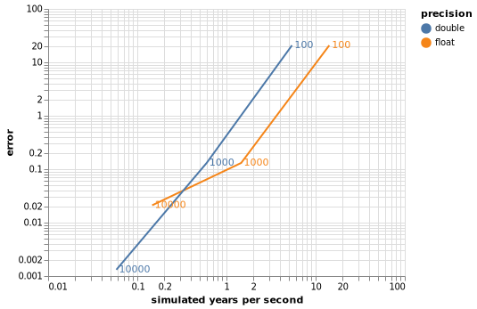

# Exercise 2: orbiting asteroid simulation

**Due:** September 8, before class.

**Collaboration:** you may work in teams of two.  Your team may consult online
resources, others in the class, and the instructor and TA, but your work must
be your own.  Copying other students' code will be considered an honor code
violation.

## Step 1 (5%): Get logged into `coc-ice.pace.gatech.edu`

Follow the steps in the [orientation slides](http://docs.pace.gatech.edu/training/img/PACE_orientation_Sep2021.pdf).

## Step 2 (5%): Getting the code

This project is hosted in a repository on <https://github.gatech.edu/cse6230fa21/cse6230ex2>.

Your team should clone the repository into a local copy that you will use to develop.

## About the code

The file `elements.txt` contains the [orbital elements](https://en.wikipedia.org/wiki/Orbital_elements)
of 585,962 asteroids from <https://ssd.jpl.nasa.gov/?sb_elem>:

```
$ head elements.txt
 Num   Name              Epoch      a          e        i         w        Node        M         H     G   Ref
------ ----------------- ----- ---------- ---------- --------- --------- --------- ----------- ----- ----- ----------
     1 Ceres             59396  2.7656553 0.07839202  10.58820  73.73827  80.26764 247.5499723  3.53  0.12 JPL 48
     2 Pallas            59396  2.7738148 0.22975842  34.89778 310.43686 172.92018 229.2297176  4.22  0.11 JPL 46
     3 Juno              59396  2.6681427 0.25696659  12.99149 247.99924 169.85223 215.0926965  5.28  0.32 JPL 121
     4 Vesta             59396  2.3616594 0.08835130   7.14154 151.01560 103.80606 311.6920605  3.31  0.32 JPL 36
     5 Astraea           59396  2.5739090 0.19062063   5.36759 358.65915 141.57082 112.3804292  6.99  0.15 JPL 121
     6 Hebe              59396  2.4254273 0.20324026  14.73993 239.60615 138.64186 294.2096859  5.65  0.24 JPL 98
     7 Iris              59396  2.3861991 0.22940210   5.51808 145.31202 259.52652 353.1265064  5.60  0.15 JPL 117
     8 Flora             59396  2.2017060 0.15596202   5.88901 285.53203 110.87603  74.7425269  6.54  0.28 JPL 126
```

The program `./simulation PRECISION N_STEPS [N_ASTEROIDS]` simulates the orbits of `N_ASTEROIDS` for 1 year (if `N_ASTEROIDS` is larger that 585,962, some are duplicated; if `N_ASTEROIDS` is omitted, it will simulate all 585,962 in the file).  It does so using `N_STEPS` time steps, each of length `1.0 / N_STEPS`.

Each asteroid is represented by the six components of its state vector:

- its position `x`, `y`, `z`
- its velocity `u`, `v`, `w`

A time step first updates each asteroids velocity from the effect of the Sun's gravity, then
uses the velocity to change the asteroids position.

The `PRECISION` is the type of floating point number used for the time step calculations: `float` (32-bit) or `double` (64-bit).

The ideal simulation should be fast and accurate, but these goals are in opposition:

- `float` arithmetic is faster than `double` arithmetic, but is less accurate
- fewer time steps makes the simulation faster, but bigger errors are made each time step

## Step 3 (30%): Parallelize the code with OpenMP

Use OpenMP to parallelize the simulation.  At a minimum, you should parallelize:

- The functions `elems_to_state_arrays()` and `compute_error()` in `simulation.cc`.
- The functions `timestep()` and `position_timestep()` in `timestep.cc`.

You are welcome to make additional parallelization changes.

Things you are not allowed to change:

- You cannot change the math in the timestep.
- All asteroids must be updated at the same time: you cannot simulate them individually or in chunks.

Other things you should change:

- Compiler optimization flags in `make.defs`
- Add OpenMP flags in `make.defs`

## Running calculations on coc-ice compute nodes

You will run your simulations on the `coc-ice` queue compute nodes.  Each one has a server with 24 Intel cores.  Some stats about these nodes:

- Maximum double precision floating point operations per second, one core (measured with BLAS `dgemm`): 71 GFlop/s
- Maximum single precision (`float`) floating point operations per second, one core (measured with BLAS `sgemm`): 150 GFlop/s
- Maximum double precision floating point operations per second, whole node (measured with BLAS `dgemm`): 1.5 TFlop/s
- Maximum single precision (`float`) floating point operations per second, whole node (measured with BLAS `sgemm`): 2.8 TFlop/s
- Maximum bandwidth from main memory, one core (measured with the STREAM benchmark): 17.5 Gbyte/s
- Maximum bandwidth from main memory, whole node (measured with the STREAM benchmark): 200 Gbyte/s

Here is the topology of a node from `likwid-topology -g`, showing each core has its own L1 cache (32 kB), L2 cache (1 MB), and 12 cores together share an L3 cache (19 MB):

```
********************************************************************************
Graphical Topology
********************************************************************************
Socket 0:
+-------------------------------------------------------------------------------------------------------------------------+
| +-------+ +-------+ +-------+ +-------+ +-------+ +-------+ +-------+ +-------+ +-------+ +-------+ +-------+ +-------+ |
| |   0   | |   1   | |   2   | |   3   | |   4   | |   5   | |   6   | |   7   | |   8   | |   9   | |   10  | |   11  | |
| +-------+ +-------+ +-------+ +-------+ +-------+ +-------+ +-------+ +-------+ +-------+ +-------+ +-------+ +-------+ |
| +-------+ +-------+ +-------+ +-------+ +-------+ +-------+ +-------+ +-------+ +-------+ +-------+ +-------+ +-------+ |
| | 32 kB | | 32 kB | | 32 kB | | 32 kB | | 32 kB | | 32 kB | | 32 kB | | 32 kB | | 32 kB | | 32 kB | | 32 kB | | 32 kB | |
| +-------+ +-------+ +-------+ +-------+ +-------+ +-------+ +-------+ +-------+ +-------+ +-------+ +-------+ +-------+ |
| +-------+ +-------+ +-------+ +-------+ +-------+ +-------+ +-------+ +-------+ +-------+ +-------+ +-------+ +-------+ |
| |  1 MB | |  1 MB | |  1 MB | |  1 MB | |  1 MB | |  1 MB | |  1 MB | |  1 MB | |  1 MB | |  1 MB | |  1 MB | |  1 MB | |
| +-------+ +-------+ +-------+ +-------+ +-------+ +-------+ +-------+ +-------+ +-------+ +-------+ +-------+ +-------+ |
| +---------------------------------------------------------------------------------------------------------------------+ |
| |                                                        19 MB                                                        | |
| +---------------------------------------------------------------------------------------------------------------------+ |
+-------------------------------------------------------------------------------------------------------------------------+
Socket 1:
+-------------------------------------------------------------------------------------------------------------------------+
| +-------+ +-------+ +-------+ +-------+ +-------+ +-------+ +-------+ +-------+ +-------+ +-------+ +-------+ +-------+ |
| |   12  | |   13  | |   14  | |   15  | |   16  | |   17  | |   18  | |   19  | |   20  | |   21  | |   22  | |   23  | |
| +-------+ +-------+ +-------+ +-------+ +-------+ +-------+ +-------+ +-------+ +-------+ +-------+ +-------+ +-------+ |
| +-------+ +-------+ +-------+ +-------+ +-------+ +-------+ +-------+ +-------+ +-------+ +-------+ +-------+ +-------+ |
| | 32 kB | | 32 kB | | 32 kB | | 32 kB | | 32 kB | | 32 kB | | 32 kB | | 32 kB | | 32 kB | | 32 kB | | 32 kB | | 32 kB | |
| +-------+ +-------+ +-------+ +-------+ +-------+ +-------+ +-------+ +-------+ +-------+ +-------+ +-------+ +-------+ |
| +-------+ +-------+ +-------+ +-------+ +-------+ +-------+ +-------+ +-------+ +-------+ +-------+ +-------+ +-------+ |
| |  1 MB | |  1 MB | |  1 MB | |  1 MB | |  1 MB | |  1 MB | |  1 MB | |  1 MB | |  1 MB | |  1 MB | |  1 MB | |  1 MB | |
| +-------+ +-------+ +-------+ +-------+ +-------+ +-------+ +-------+ +-------+ +-------+ +-------+ +-------+ +-------+ |
| +---------------------------------------------------------------------------------------------------------------------+ |
| |                                                        19 MB                                                        | |
| +---------------------------------------------------------------------------------------------------------------------+ |
+-------------------------------------------------------------------------------------------------------------------------+
```

You can run your code by running an interactive, like this

```
qsub -d $PWD -q coc-ice -l nodes=1:ppn=24,walltime=01:00:00 -I
```

or by submitting a job to the queue.  There are two example job scripts in this repository for you:

- `figure_one_reference.pbs`
- `figure_two_reference.pbs`

Each job script compiles the simulation from scratch and saves the output of a series of simulations into a `.json` file.

**Do not run your code on the login nodes.**  If you want to develop interactively, get an interactive session.

## Step 4 (20%): make figure 1 (work rate as a function of problem size)

Your first figure will show how the work rate (asteroid time steps per second), changes with the number of asteroids in the simulation.

Make a submission script `figure_one.pbs` that runs `float` and `double` simulations for different numbers of asteroids, using **24 OpenMP threads**.  You should make sure:

- At the small end, you should test a number of asteroids that fits in the L1 cache of one core (< 32 kB)
- At the large end, you should test a number of asteroids that is too large to fit into both L3 caches (> 19 MB + 19 MB = 38 MB).
- You test a wide range of numbers in between (at least 10)
- Your tests' `runtime (seconds)` should be at least a millisecond: you can ensure this by changing the number of time steps

Use the plotting software of your choice to create a chart of your data.  Here is an example from running the serial code (the format of this reference is acceptable, but it does not test a wide enough range of values)



## Step 5 (20%): make figure 2 (a work / precision diagram)

Your second figure will show what the trade-offs between speed and accuracy are.

Make a submission script `figure_two.pbs` that runs `float` and `double` simulations for all 585,962 using **24 OpenMP threads** for differing number of time steps.  You should make sure:

- You include a small enough number of time steps that both precisions' simulations have an `error` > 1.
- You include a large enough number of time steps that `error` of both precisions stops decreasing, or the runtime of your simulation reaches 10 minutes.
- You test a wide range of time steps in between (at least 10)

Use the plotting software of your choice to create a chart of your data.  Here is an example from running the serial code (the format of this reference is acceptable, but it does not test a wide enough range of values).  Each data point is labeled by its number of time steps.



## Step 6 (15%): make a report

Make a report `report.pdf` that includes your two figures, and answers to the following three questions:

1. (5%) For each of `float` and `double`, find the largest value of `asteroid time steps per second` in figure 1, and determine what percentage of the peak Tflop/s of the node it achieves.  (To figure this out, you will have to determine how many flops are in an asteroid time step.  Estimate this by looking at the code in the `timestep()` function, which is where almost all of the time is spent.)

2. (5%) For each of `float` and `double`, look at the `asteroid time steps per second` of the largest number of asteroids you simulate and estimate what percentage of the peak Gbyte/s of bandwidth from main memory it achieves.  (To figure this out, you will have to determine the number of bytes read and written in each asteroid time step.)

3. (5%) Look at figure 2 and give guidance to someone who want to use your simulation about when they should use single precision or double precision arithmetic.

## Step 7 (5%): submit your work

- Check in to your repository your `report.pdf`, `figure_one.pbs`, and `figure_two.pbs` files, as well as any additional files you may have added that are necessary to build your program.

- Create one **private** repository for your team on `github.gatech.edu` and push your final version there.  The name of your repository should look like `cse6230ex2-gtid1` or `cse6230ex2-gtid1-gtid2` for a team.

- When you are ready to submit, [transfer ownership](https://docs.github.com/en/github/administering-a-repository/managing-repository-settings/transferring-a-repository) of your repository to the group `cse6230fa21`.

- On canvas, your "submission" will just be the name of your repository.

- The TA will submit your `figure_one.pbs` and `figure_two.pbs` submission scripts to verify your code.


